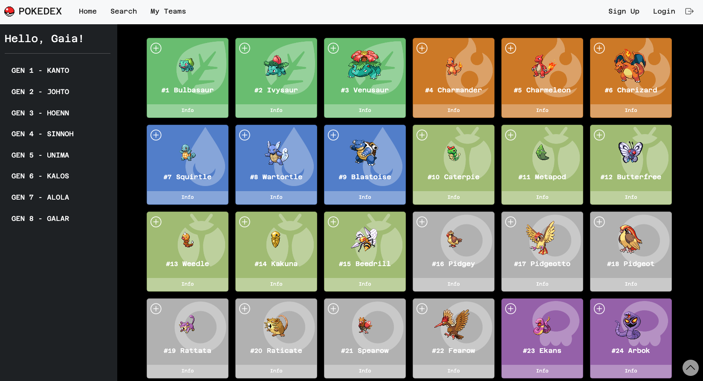
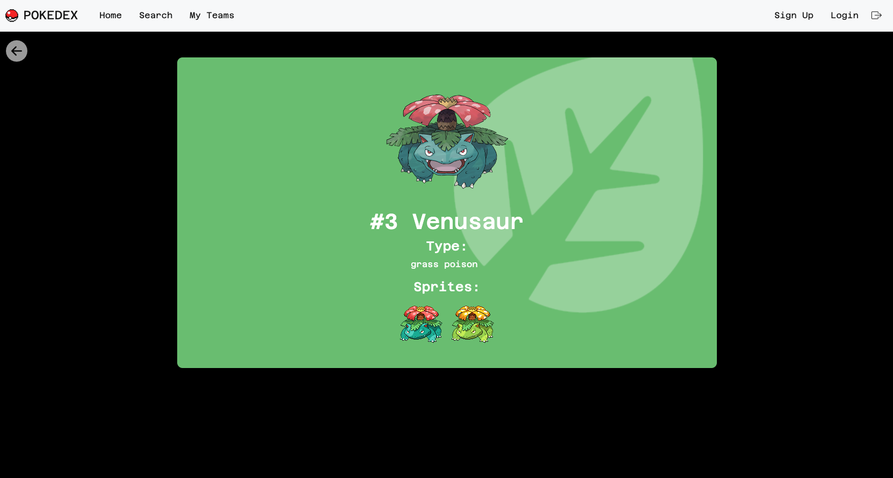
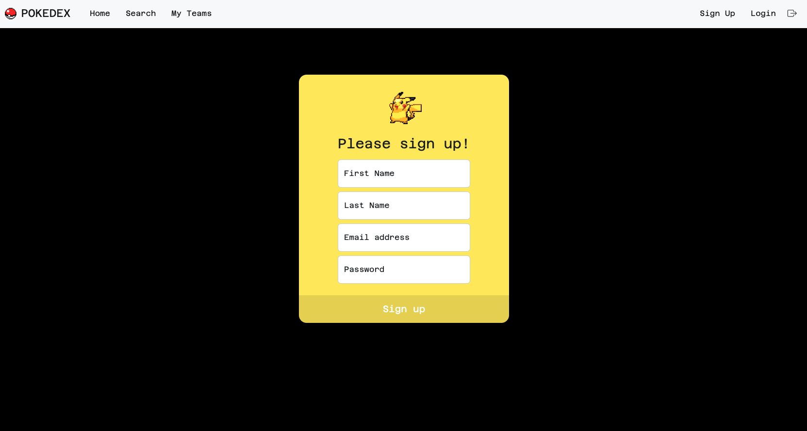
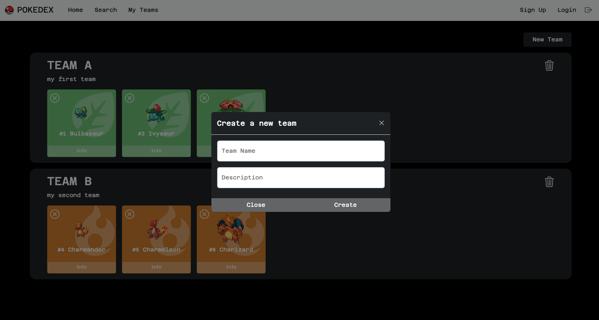
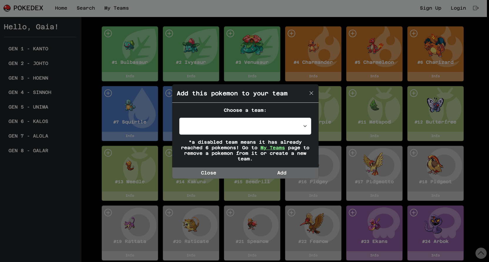

# CapstoneProject - POKEDEX

This project is a Pokédex realized with Angular CLI (version 14.2.7) using the API PokéAPI.

Screenshots:

---

---

---

---

---

---

## Development server

Run `ng serve` for a dev server. Navigate to `http://localhost:4200/`. The application will automatically reload if you change any of the source files.

## Build

Run `ng build` to build the project. The build artifacts will be stored in the `dist/` directory.
